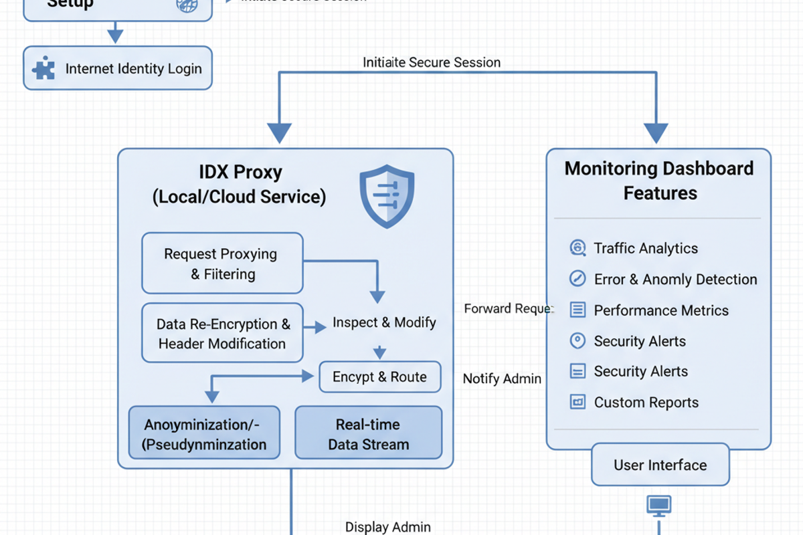

# FreQuid Network

## _Web Request TLS Monitor and Recryptor_

**Real-time dashboard for monitoring proxied web requests and enabling data encryption for important data.**

---

---

## Overview

This project provides a secure, session-based system for monitoring browser web requests via a proxy, featuring advanced detection and alerting for TLS termination events (including HTTP/2 and HTTP/3/QUIC). It includes a Chrome extension for easy proxy setup, a web UI for real-time monitoring, and a robust backend on the Internet Computer (ICP) for session management, re-encryption, and user-controlled data release.

---

## Features

- **Browser Extension:** One-click Chrome extension to route all browser traffic through the IDX proxy.

- **Real-Time Dashboard:** View all proxied requests with advanced filters (protocol, authentication, key agreement, method, data type, endpoint info, CA status, E2E/mutual auth, hops, payload type, forward secrecy).

- **TLS Termination Alerts:** Notifications for any detected TLS termination both inside and outside the ICP network.

- **Re-Encryptor:** Sensitive data is re-encrypted with ChaCha20-256 and a unique nonce/IV if TLS is terminated externally; only the user can approve the release of 
plaintext to endpoint servers.

- **Decryption Approval Workflow:** Users can approve/deny plaintext requests via the UI, with all actions logged.

- **Session Export:** Export session data as CSV or JSON.

- **Liveliness Detection:** Background detection of user presence via keyboard/mouse activity for session security and encryption entropy.

- **Process Flow Diagram:** Visual architecture and process flow available in the UI and as `frontend/public/idx-process-flow-diagram.dim_1200x800.png`.

---

## Architecture

- **Frontend:** React, TypeScript, Tailwind CSS, React Query, Internet Identity authentication.

- **Backend:** Motoko smart contract on ICP, session-based request logging, filtering, re-encryption, and decryption approval.

- **Extension:** Chrome extension (see `extension/README.md`) for automatic proxy configuration.

---

## Setup

1. **Clone or Download:** Copy all source files and image assets into their respective folders as described below.
  
2. **Install Extension:** Follow `extension/README.md` to load the Chrome extension and configure the proxy.

3. **Capture Internet Traffic**

4. **Recrypt as Needed**
